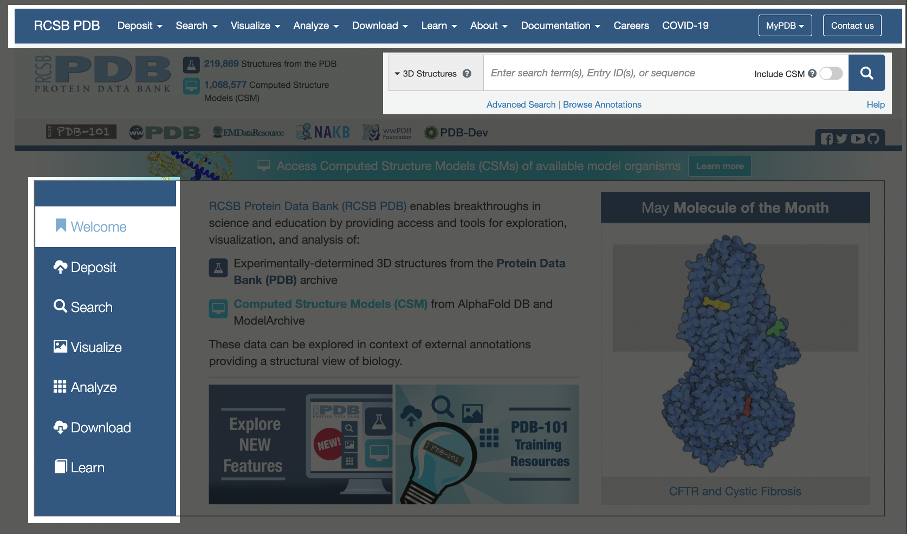

# Supplementary material for “A guide to developing web tools for bioinformatics”

In this document, we present an example application of the "Checklist of important resources for user-friendly web tools".
As a case study, we use the PDB (Protein Data Bank) tool as a good example. PDB is available at https://www.rcsb.org/.
Therefore, for each item in the guideline we will present why the PDB web tool meets that requirement.

## Requirement #1. Quickstart

<cite>
The interface should be obvious enough for users to perform a quick analysis. Provide a button on every page that takes users to the page that starts new executions of the tool or that allows them to search and explore data. Use keywords like "new", "explore", "begin", "try", "start", "run", “home", "search", "analysis", and so on.
</cite>

