# A guide to developing web tools for bioinformatics

~~~
Supplementary material for "Ten simple rules for developing and evaluating user-friendly web tools".
~~~

In this document, we present an example application of the *"Checklist of important resources for user-friendly web tools"*.

Below, we introduce **10 recommendations for producing good web tools for bioinformatics and computational biology applications**. Then, we present a case study of a tool that meets all the requirements (the PDB website), so it can be considered a good example to be followed.

## The Guideline

This guide proposes 10 simple rules for developing a web tool for bioinformatics and producing an article promoting the tool. You can download a PDF with this checklist <a href="data/checklist.pdf">here</a>. 

The 10 requirements are:

> <b><a href="#requirement-1-quickstart">1. Quickstart</a></b>

> <b><a href="#requirement-2-simple-interface">2. Simple interface</a></b>

> <b><a href="#requirement-3-explain-what-this-tool-is">3. Explain what this tool is</a></b>

> <b><a href="#requirement-4-documentation-and-tutorials">4. Documentation and tutorials</a></b>

> <b><a href="#requirement-5-allow-exploration">5. Allow exploration</a></b>

> <b><a href="#requirement-6-handle-errors">6. Handle errors</a></b>

> <b><a href="#requirement-7-use-visualizations">7. Use visualizations</a></b>

> <b><a href="#requirement-8-export-results">8. Export results</a></b>

> <b><a href="#requirement-9-how-to-cite-this-tool">9. How to cite this tool</a></b>

> <b><a href="#requirement-10-linking-article-to-tool">10. Linking article to tool</a></b>

A case study of implementing these 10 simple rules is available <a href="#case-study">here</a>.

# Teorical fundamentals for our principles

Our princples are based on the Few's 13 mistakes to avoid when developing dashboards and on the Nielsen's 10 principles for designing interfaces.

## Few's 13 mistakes to avoid 

Dashboards are panels used to summarize data sets into single pages. Despite the differences, some insights into their development can be applied to scientific web applications. The main problem when planning a dashboard is squeezing vast amounts of information onto an easily understandable single screen. Stephen Few [1], in the book “Information Dashboard Design”, highlights 13 main mistakes web developers make when designing dashboards. We adapted Few’s mistakes for developing web-effective applications for bioinformatics:

1. Exceeding the boundaries of a single screen: This is not exactly a mistake in the case of scientific web applications. Dashboards need to be concise, clear, and intuitive display mechanisms that summarize information in a small space. Additional information should be accessed on demand. However, this can be complex to implement, even for experienced web developers. Therefore, ensure that your application maintains consistency in the interface on most pages.

2. Providing inadequate context for the data: Suppose your tool displays a certain numerical value due to an analysis. You must give context about what this value means. Is this good, or is this bad? You can use colors or icons (e.g., arrows) to indicate context. Furthermore, you can use explanatory texts such as "the higher, the better" or "values closer to 1 indicate a greater relationship while closer to zero indicate a smaller one". Longer or more detailed explanations on demand could also be considered.

3. Display excessive details: Let us say your program uses the value of pi for some calculation and displays on the screen: 3,14159265358979323846... It may not be necessary to display so many decimal places, i.e., you could display only 3.14 and use the extra decimal places only in the backend for calculations. Alternatively, let us say your program returns a huge table with hundreds of parameters and their methodological details. You can display a summary and allow the user to export the rest of the data if necessary (on-demand access). On the other hand, suppose that your tool presented an error when the user submitted a determined file with a problem. You should not display the entire system error log to the user but rather present the necessary information for the user to understand and recover from the error.

4. Choosing a deficient measure: Suppose your tool will display genome sizes in base pairs (bp). Many developers may feel comfortable using acronyms such as 1 Kb and 1 Mb to indicate 1,000 bp and 1,000,000 bp, respectively, and thus save space. When displaying data from a unique entry, you can represent it however you see fit. Nonetheless, when presenting comparison tables, using different metrics can confuse readers. For example, displaying the size of a 3 Kb virus genome next to a bacteria genome (3 Mb) and human genome (3 Gb) is less impactful than displaying the entire values: virus=3,000; bacteria=3,000,000; human=3,100,000,000.

5. Choosing inappropriate display media: Choosing the wrong graphics and visualizations can complicate your tool users’ lives. For example, 3D pie charts are quite complex to compare (try analyzing a pie chart with many slices). Therefore, you should always look for the correct data visualization technique for each type of problem that your tool addresses.
Present varieties of meaningless visualizations: You should not include graphics just because they make your tool look nice. Overly displaying visual components hinders understanding of the results you want to display. Sometimes, less is more. 

6. Using poorly designed visualizations: Be careful when displaying visualizations that may create difficulties for users to understand them. For instance, plots without captions or with similar colors.

7. Encoding quantitative data inaccurately: It is possible to tell lies with data by only showing part of the truth (see [6]). Consider, for example, a bar chart showing that your tool achieved an accuracy of 65% while competitor tools achieved 61% and 62%. These values are quite similar, indicating that the tools’ results are not that different. However, imagine what would happen if you displayed a bar chart that starts at 60%. Wow! Now, your results look much higher than those of your competitors. By doing this, you would be changing the perception of the context to give the impression that your results are better than they really are.

8. Organize data poorly: When displaying your results, you should group related information closer together. Messy results can confuse users and be harmful.

9. Highlighting important data ineffectively: Some parts of the screen attract users’ attention the most. For example, the top left part is usually considered one of the most important regions of a web application. Therefore, this is where we should add vital website information, such as the title and logo. The top part is also used to add general access menus, while the left side is generally used to add complementary menus. The footer is a less frequently viewed part but can be used to add less commonly required institutional or contact information.

10. Filling the screen with useless decoration: You might believe that adding a photo of your lab team spinning and shining will make your website more elegant. Remember that this would probably not make sense or be important to users. Including unnecessary visual components will only take up useful space, competing with relevant information for the users’ attention.

11. Improper or excessive use of colors: Color contrast is a property that can be used to draw attention to parts of the screen. However, using many different colors to highlight various parts can have the opposite effect. When a lot of things are highlighted, nothing is actually highlighted. Furthermore, you should take care with certain color combinations that cannot be correctly perceived by people with visual impairments, such as color blindness. For example, when displayed side by side, the colors red, green, and yellow can hardly be differentiated by people with deuteranopia.

12. Design an unattractive visual display: Lastly, your web application must be visually attractive, or it could turn away potential users.

13. Furthermore, Few suggests using Gestalt principles [2] of visual perception for designing dashboards, such as proximity, similarity, enclosure, closure, continuity, and connection. He also suggests using attributes that evoke users' visual perception, such as color, shape, position, and movement [3]. Therefore, consider these elements when designing the interface of your scientific web application. Remember that your primary focus should be to provide the user with a good experience using the tool and with useful data and visualizations. Thus, they can use it as a complementary element in their research.

## Nielsen's 10 principles for designing interfaces

In 1994, Jakob Nielsen proposed 10 principles for designing user interfaces [4-5]. In this section, we describe each heuristic and present their application to developing scientific web tools.

1. Visibility of system status: “Ideally, systems should always keep users informed about what is going on through appropriate feedback within a reasonable time”. Thus, whenever users interact with a part of the system, they should be able to understand which part of the system they are at and its status (i.e., what the system is doing). For example, if users ran an experiment, they should be informed whether the execution is currently being carried out, whether it presented any errors, or whether it was completed successfully.

2. Match between system and the real world: “The system should speak the users’ language, with words, phrases, and concepts familiar to the users”. It is inevitable that academic and scientific applications use technical jargon. That is okay if the users are expected to be scientists or academics who understand the terms. If you expect lay users to interact with the system, consider using expressions they would know or have an explanation available for more technical terms. Furthermore, use common terms and words for interface actions. For example, let us say you are building a search component for your application. Use common text expressions (e.g., search/find), common icons (e.g., magnifying glass), and web elements (input field of text type with placeholder).

3. User control and freedom: “Users often choose system functions by mistake and will need a clearly marked ‘emergency exit’ to leave the unwanted state without going through an extended dialogue. Support undo and redo”.  Interrupting an execution can pose significant challenges in bioinformatics web pipelines, as these pipelines rely on the sequential execution of multiple tools. Furthermore, interrupting this flow could cause the experiment to start over from scratch. Thus, in this case, the system should confirm any action that might have a negative impact on users.

4. Consistency and standards: “Users should not have to wonder whether different words, situations, or actions mean the same thing. Follow platform and industry conventions”. Using an inconsistent layout can increase users' cognitive load, forcing them to always have to learn something new on each screen. Therefore, it is recommended to maintain consistency considering your application (use the same layout structure, style, and colors on most pages) and general standards used for developing web applications. For example, if there is an institutional or project logo, it is usually placed on the top left corner of the screen. The main menu is also added at the top next to the logo (in some cases, the menu may be added to the left corner). The footer is generally used to add links, institutional information, contact forms, usage licenses, or extra tool descriptions.

5. Error prevention: “It is important to prevent problems from occurring. Either eliminate error-prone conditions or check for them and present users with a confirmation option before they commit to the action”. Inform users of any predefined format of input data. In cases in which users’ actions may impact a processing pipeline (e.g., interrupting a sequential execution; as discussed in item 3), inform users of the results of the action and require them to confirm the action. 

6. Recognition rather than recall: “Minimize the user's memory load by making elements, actions, and options visible. The user should not have to remember information from one part of the interface to another. Information required to use the design (e.g., field labels or menu items) should be visible or easily retrievable when needed”. Do not force users to remember all your application’s elements and options. Take, for example, the parameters that users can set before running an application. Many developers of scientific applications rely on their users to already know the parameters from their academic and professional experience or from seeing the description in the tool’s article or documentation. Therefore, they often only provide an acronym for a given property that users need/can set. However, remembering acronyms increases the user's memory load. Interfaces must offer help in context. For instance, web applications can use dialog boxes loaded on demand, such as modals, popovers, lightboxes, tooltips, and dialogs, among other components. 

7. Flexibility and efficiency of use: “Shortcuts (hidden from novice users) may speed up the interaction for the expert user so that the design can cater to both inexperienced and experienced users. Allow users to tailor frequent actions”. Allowing users to customize the interface can speed up their interaction with the system. However, this would involve controlling users’ access to the system, which can increase the complexity of developing the system. It is important to highlight that several web frameworks provide base codes that can facilitate the development of this type of resource. Standard web components such as cookies and sessions can also be used to store common user choices.

8. Aesthetic and minimalist design: “Interfaces should not contain information that is irrelevant or rarely needed. Every extra unit of information in an interface competes with the relevant units of information and diminishes their relative visibility. Furthermore, aesthetically pleasing designs can provide memorable experiences to users”. This is a point that both Nielsen’s and Few’s recommendations have in common:  interfaces should not contain information irrelevant to users’ goals in the context of the system. For example, do not add exaggerated images, animations, or effects when developing your application. Also, do not overload your interface with methodological details described in the paper (if necessary, include these details on demand).

9. Help users recognize, diagnose, and recover from errors: “Error messages should be expressed in plain language (no error codes), precisely indicate the problem, and constructively suggest a solution”. Traditional visual resources, such as red text, could be used to help users identify the errors.

10. Help and documentation: “It’s best if the system doesn’t need any additional explanation. However, it may be necessary to provide documentation to help users understand how to complete their tasks”. Interfaces should be designed to be simple and intuitive. However, you should always provide extra help content and complete documentation explaining how to use the components according to a determined context so that users may refer to it in case they need it to recover from errors or better understand the system.

## Gestalt principles

Gestalt principles are fundamental concepts of Gestalt psychology that explain how humans tend to organize visual elements into cohesive, meaningful units. "Gestalt" is a German word meaning "shape" or "configuration." Gestalt theory emphasizes that the whole is perceived differently than the sum of its parts.

Below, we present seven Gestalt principles:

1. Proximity: Elements that are close to each other tend to be perceived as a group.

2. Similarity: Elements that are similar in appearance, such as similar shape, color, size, also tend to be perceived as part of a group.

3. Continuity: The human mind tends to follow continuous lines and patterns. We prefer to see a continuous line rather than separate segments.

4. Closure: The mind tends to fill in gaps to create a complete image. Imagine, for example, a circle with a missing part is still perceived as a complete circle.

5. Figure-Ground: This principle describes how we distinguish an object from its background.

6. Symmetry and Order: Elements that are symmetrical or that form a pattern are perceived as more orderly and therefore can be identified as a group.

7. Common Fate: Elements that move in the same direction are perceived as more related than elements that move in different directions.

## Case study

As a case study, we use the PDB (Protein Data Bank) tool as a good example. PDB is available at https://www.rcsb.org/.

Therefore, for each item in the guideline we will present why the PDB web tool meets that requirement.

### Requirement #1. Quickstart

>The interface should be obvious enough for users to perform a quick analysis. Provide a button on every page that takes users to the page that starts new executions of the tool or that allows them to search and explore data. Use keywords like "new", "explore", "begin", "try", "start", "run", “home", "search", "analysis", and so on.

**Does the website meet this requirement?** Yes.

**Why?** The PDB home page, the website used in this case study, provides resources so that the user can quickly understand the objective of the tool. For example, we can quickly understand that it is a protein database and that we can search for specific proteins. Additionally, the top menu has some of the recommended keywords.

Available at https://www.rcsb.org/. Acessed at May 18, 2024.

### Requirement #2. Simple interface

>The interface should be simple and clean. It is recommended to use neutral colors (gray, white, black) for most components. Use color contrast to indicate points you want to draw attention to. You can use warm colors (red, yellow, or orange) to draw attention to specific points. Don't include too many visuals that overwhelm users' perception.

**Does the website meet this requirement?** Yes.

**Why?** The interface uses common features on web pages, such as top menus, a logo on the top left side, and a welcome message on the home page with brief explanations of what the tool is about. Furthermore, the interface was built using clean colors, making it easier to detect website sections. Note that I do not use excessive warm colors. The red section on the page draws attention to new features, which indicates good use of colors.

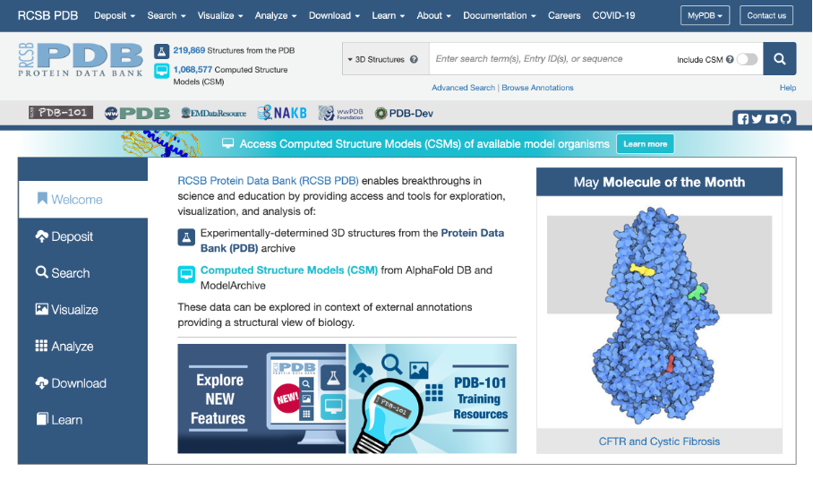

### Requirement #3. Explain what this tool is

> The interface must indicate the name of the tool (include a logo in the most important region of the page: the top left side) and provide descriptions about it (you can use subtitles, short description texts on the home page and /or include a link to "about" or "help" sections in the main menu).

**Does the website meet this requirement?** Yes.

**Why?**  The home page provides brief explanations about the purpose of the application.
 
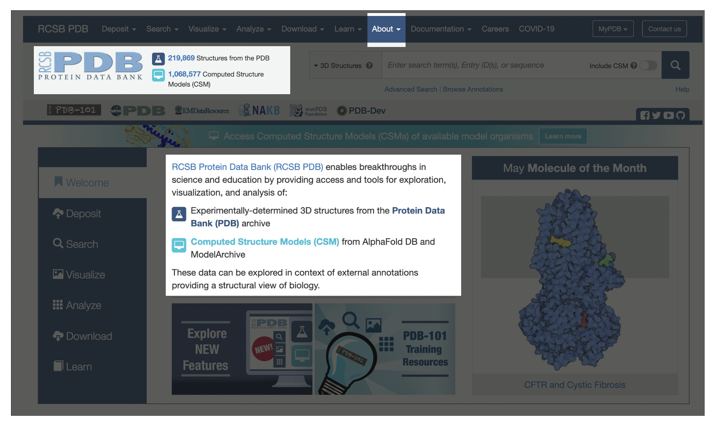

To learn more, the top menu provides the "about" item, from which users can obtain specific information on demand.

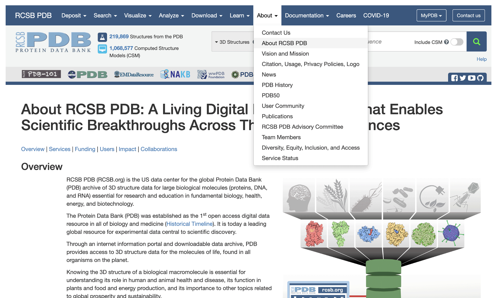 

 
### Requirement #4. Documentation and tutorials

> Provide complete documentation and usage tutorials. This documentation can be added as HTML on a separate page or can be included in PDF or MD format files. Access links should preferably be in the main menu. Video tutorials are welcome. When including functions that allow you to change parameters, include quick ways for the user to learn more about the parameter. You can include contextual help, such as descriptive text next to the field, or help buttons that are accessible on demand (when clicked or when the mouse is hovered over the button).

**Does the website meet this requirement?** Yes.

**Why?** In the top menu, the user can click on the "documentation" button and access detailed explanations for various features of the tool.

For example, the user can click on the FAQ page to consult frequently asked questions.

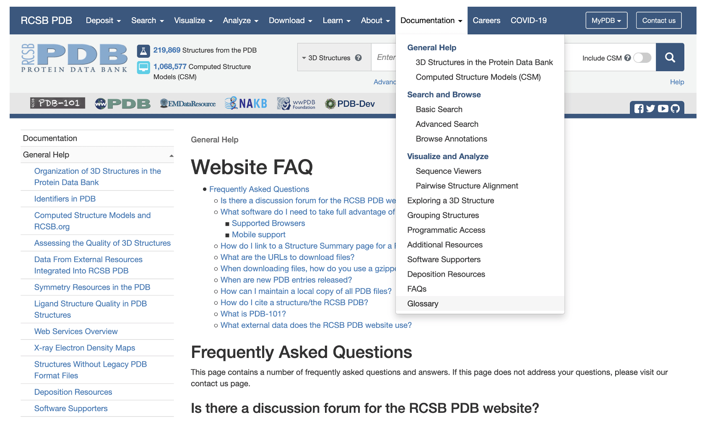 

*Available at https://pdb101.rcsb.org/learn/guide-to-understanding-pdb-data/introduction*

 

Furthermore, the PDB provides a special section for training in basic fundamentals in the field of macromolecule analysis. Note that the page interface changes to indicate that it is a different resource than the main website.

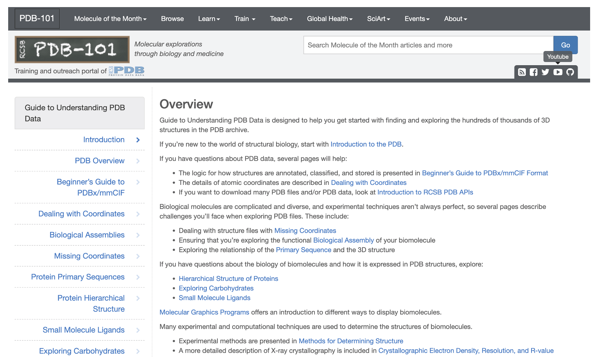

They go further by including links to a YouTube channel, with video tutorials on the tool's features and research fundamentals.

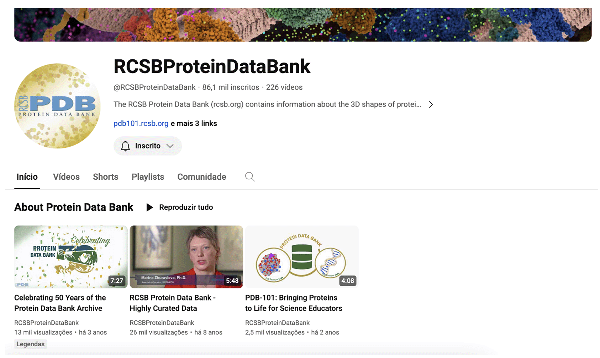

*Available at https://www.youtube.com/user/RCSBProteinDataBank*
 
### Requirement #5. Allow exploration

>Provide a way for users to explore your data. You can provide a page to explore and filter examples, create an entry example page, provide a simple example in Quickstart, or just put that example in the documentation. 

**Does the website meet this requirement?** Yes.

**Why?** On the home page, they provide a link to the individual page of an example entry. They display the most recent entries included in the database or link to the editors' chosen "molecule of the month". 

Users can also click on the numerical value next to the logo to list the most recent structures.

 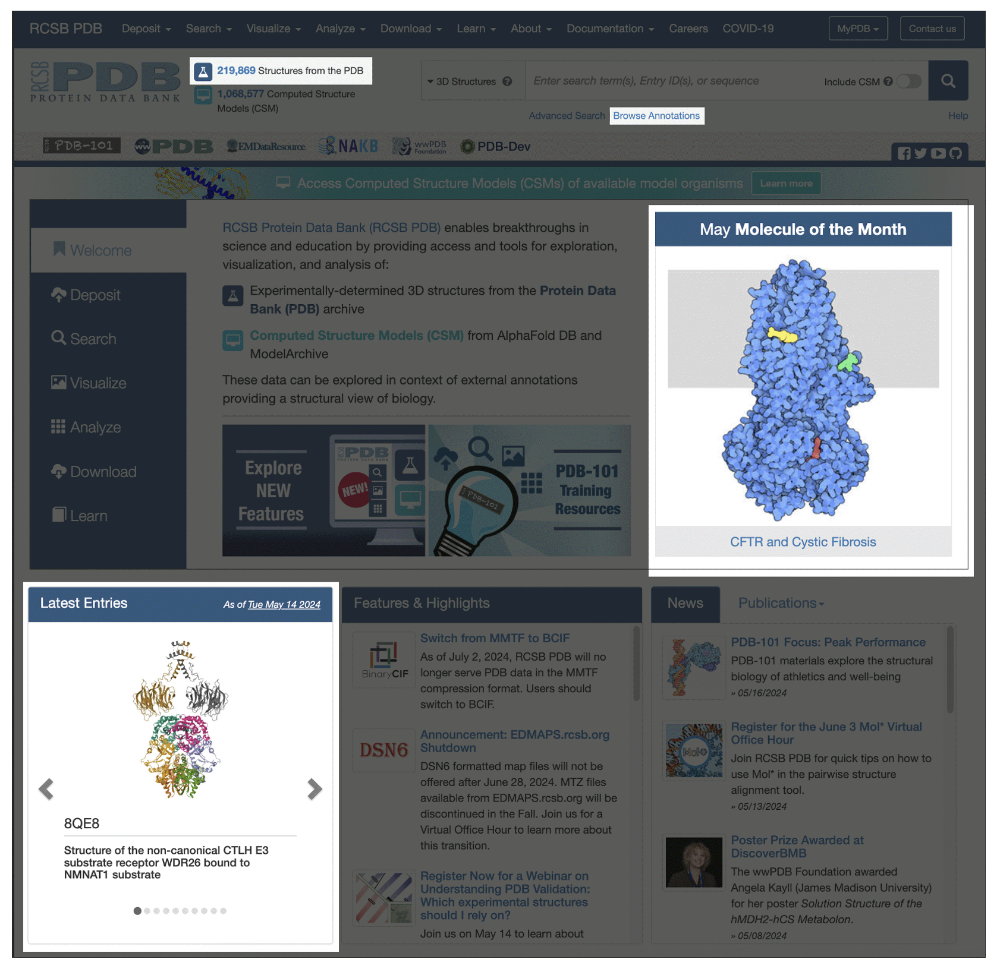

After choosing one of the entries, the user is taken to their individual page. All individual entry pages should have a similar interface with visuals that make it easy to compare different entries.

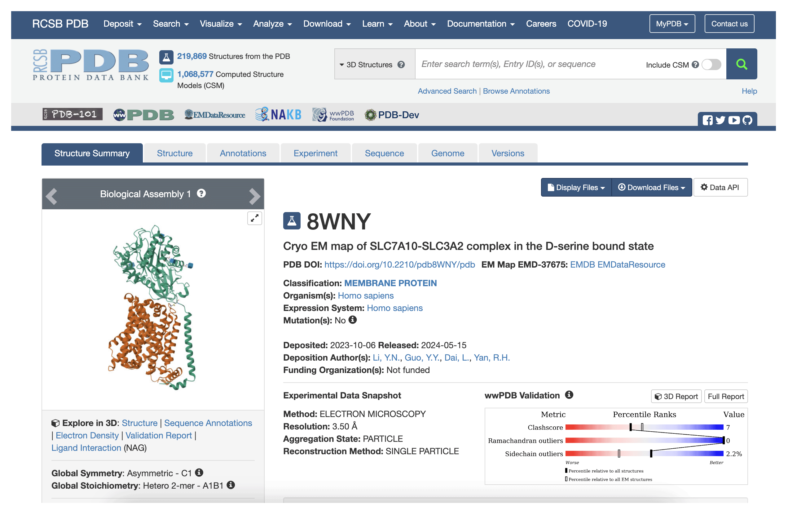

*Available at https://www.rcsb.org/structure/8WNY*

 

For example, the user can navigate to different features of this page through the menu that appears just below the main menu.
The positioning of these items makes it easier to explore this page.

### Requirement #6. Handle errors
>Errors are usually unavoidable. When developing a web tool, you must anticipate possible errors and provide the system with ways to prevent them when possible, or handle them and display personalized messages that explain them. Therefore, conduct tests with the development team and external users without prior knowledge of the tool. Additionally, provide ways for users to get in touch if they encounter any errors. If your tool allows data entry, explain how these files should be formatted so that errors do not occur.

**Does the website meet this requirement?** Yes.

**Why?** This database provides a series of error handling. For example, look at what happens if we search for an identifier that does not exist.

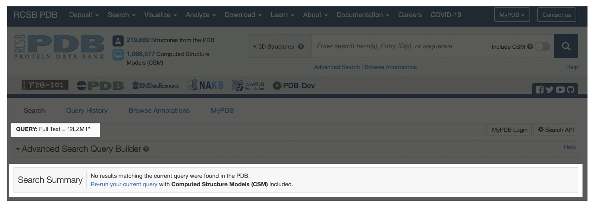

Another example is when we try to access a non-existent page.

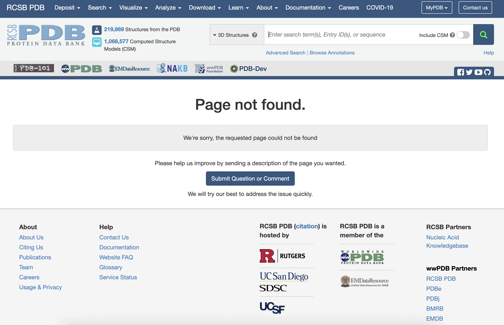

### Requirement #7. Use visualizations

>Use data visualization features such as interactive charts and tables. Remember that visualizations should make data easier to understand and should not be added just because they are pretty. Often, bar or line charts and tables that allow sorting can be the best ways to display results.

**Does the website meet this requirement?** Yes.

**Why?** Data visualizations are features that allow for better analysis and understanding of the data sets presented by the web tool. PDB has a series of different interactive visualizations that make good use of web technologies' advantages for data visualization.

In this example, we can see an interactive visualization of protein structure. The user can click on parts of the protein to view details. You can also rotate, translate, and zoom parts of the structure you want to see better. JavaScript plugins provide this visualization.

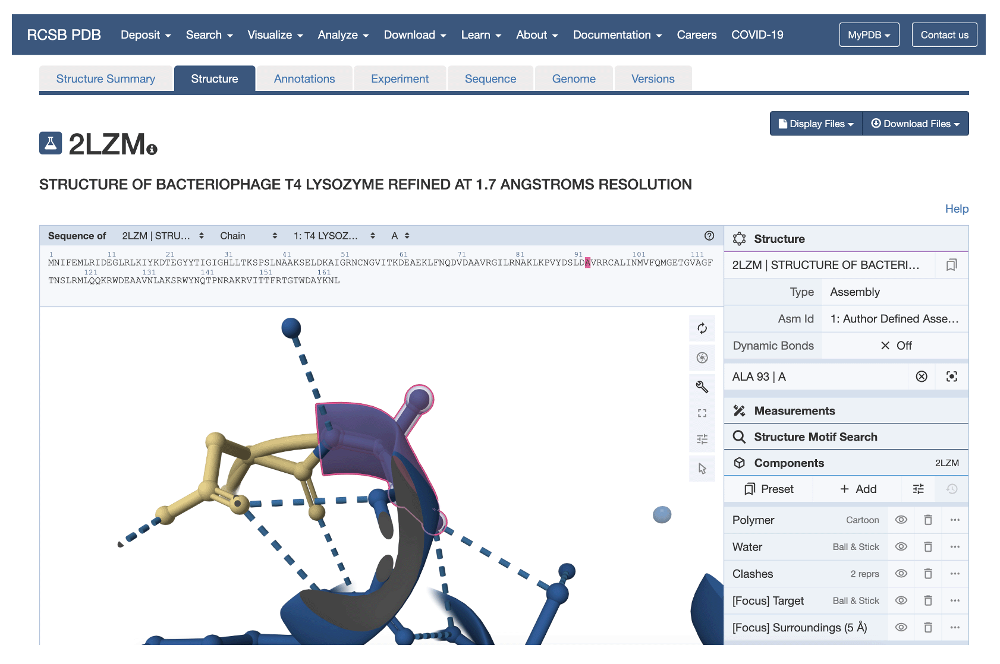 

*Available at https://www.rcsb.org/3d-view/2LZM?preset=validationReport*

 

They also use other more traditional visualizations, such as bar, area and point graphs, to present details of the structure.

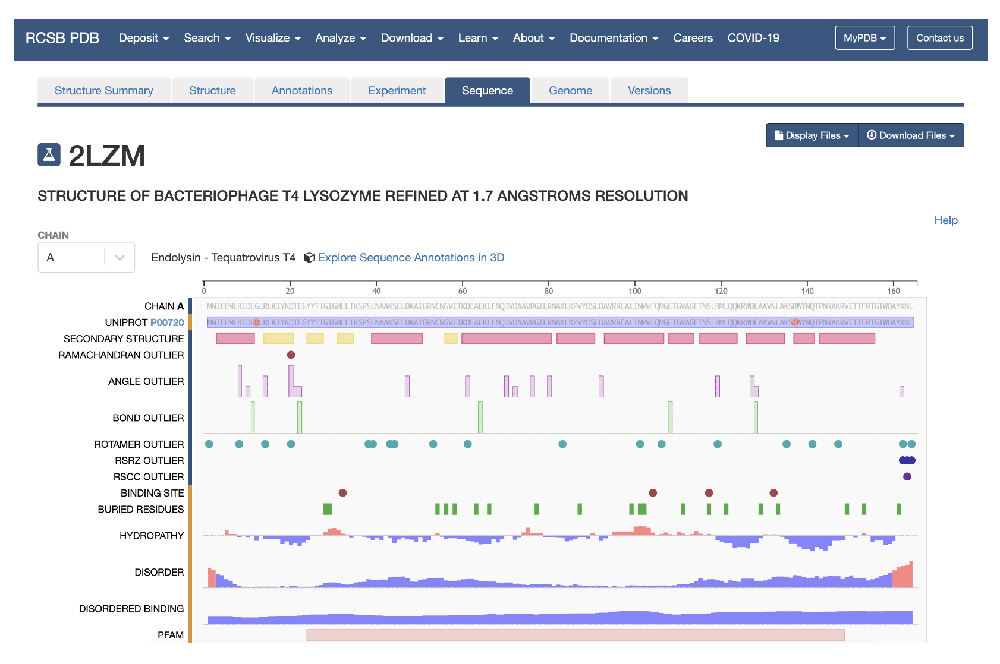

*Available at https://www.rcsb.org/sequence/2LZM*

 

The use of colors is also used in visualizations to indicate the quality of the data (typically, red indicates low quality, while blue indicates high quality).

*Available at https://www.rcsb.org/structure/2LZM*

 
### Requirement #8. Export results

>After using your tool, users may need or want to export the data (raw data, figures, and tables). Provide ways for this, and explain the available output formats.

**Does the website meet this requirement?** Yes.

**Why?**  The application allows data download and provides links on the main menus.

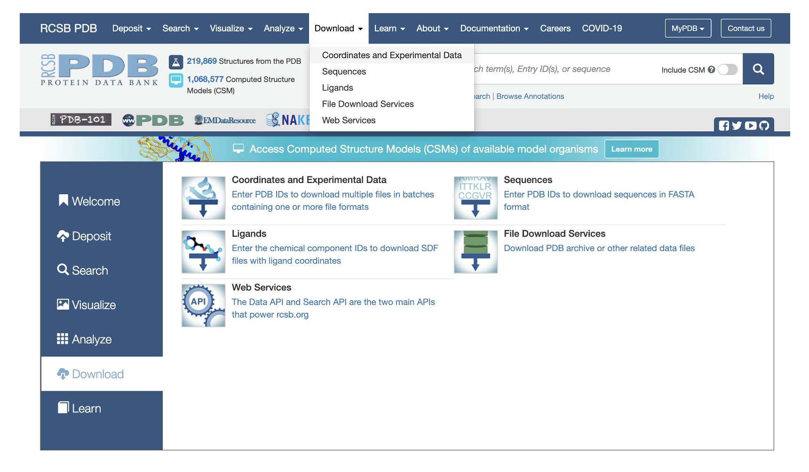

*Available at https://www.rcsb.org/stats/growth/growth-released-structures*

Additionally, on specific pages that display charts, you can download the data that generates the visualization.

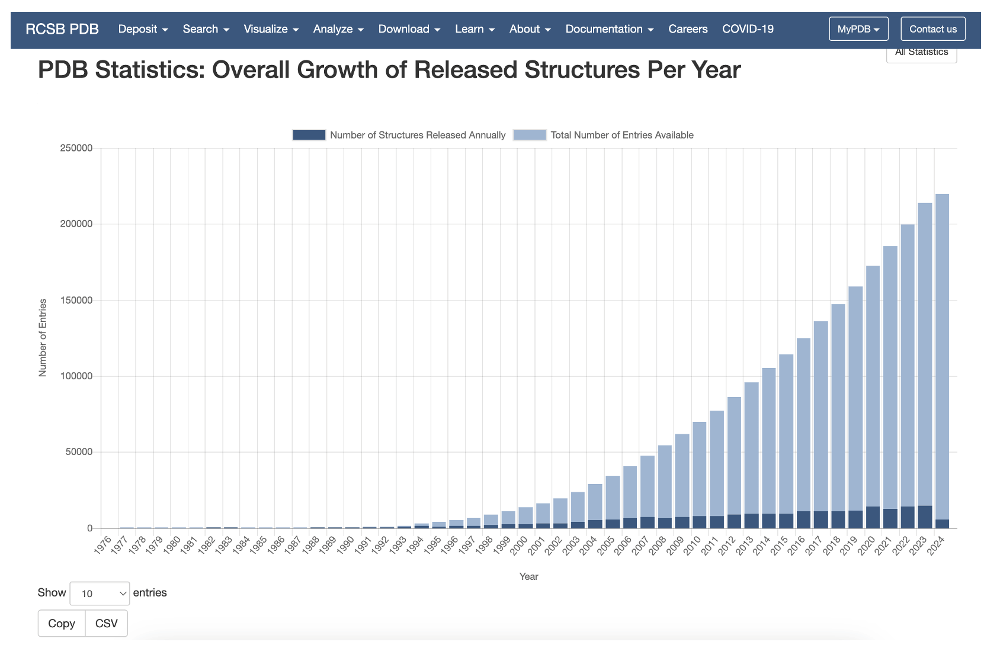

### Requirement #9. How to cite this tool

>Indicate in the interface how you want users to cite your tool (you can add it in the footer or create a page indicated in the main menu). It is okay to ask users to cite more than one paper (sometimes, you may have published the methodology and the web tool in different papers). However, it is important to use common sense (e.g., do not ask to cite too many articles).

**Does the website meet this requirement?** Yes.

**Why?** The website provides a link to indicate how the tool should be cited. As it is an academic tool, developers must be concerned about how users should cite their tool. Generally, this information is displayed in the footer of websites.

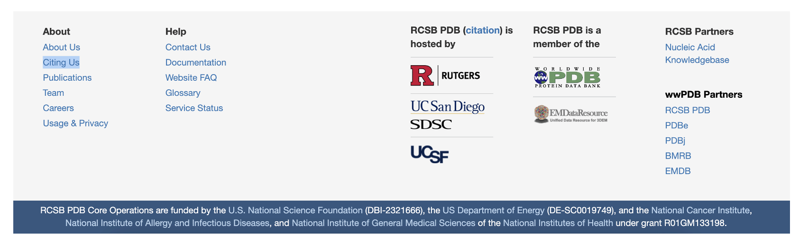

When clicking on this link, the user is taken to a page that will display details of different contexts in which the database can be cited.

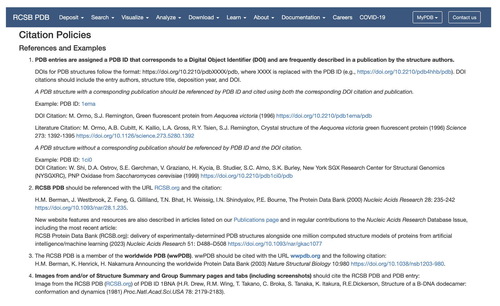 

*Available at https://www.rcsb.org/pages/policies#References*

 
### Requirement #10. Linking article to tool

>The access link for the tool paper must be visible in the manuscript (preferably in the abstract). Ensure that the link is available and that there are no broken links in the article. Broken links create a bad first impression.

**Does the website meet this requirement?** Yes.

**Why?** The authors include a link to the tool in the abstract of the publication.

The last requirement is not directly related to the tool, but rather to the article that describes it.

Some authors forget to include the tool's access link when submitting a paper. This link is essential for reviewers to test the tool's features and evaluate its usability.

To evaluate this topic, we consulted the following publication:

<code>H.M. Berman, J. Westbrook, Z. Feng, G. Gilliland, T.N. Bhat, H. Weissig, I.N. Shindyalov, P.E. Bourne. <b>The Protein Data Bank (2000)</b>. Nucleic Acids Research 28: 235-242 https://doi.org/10.1093/nar/28.1.235.</code>

When consulting the publication that describes this tool, we can see that the link was added in the abstract.

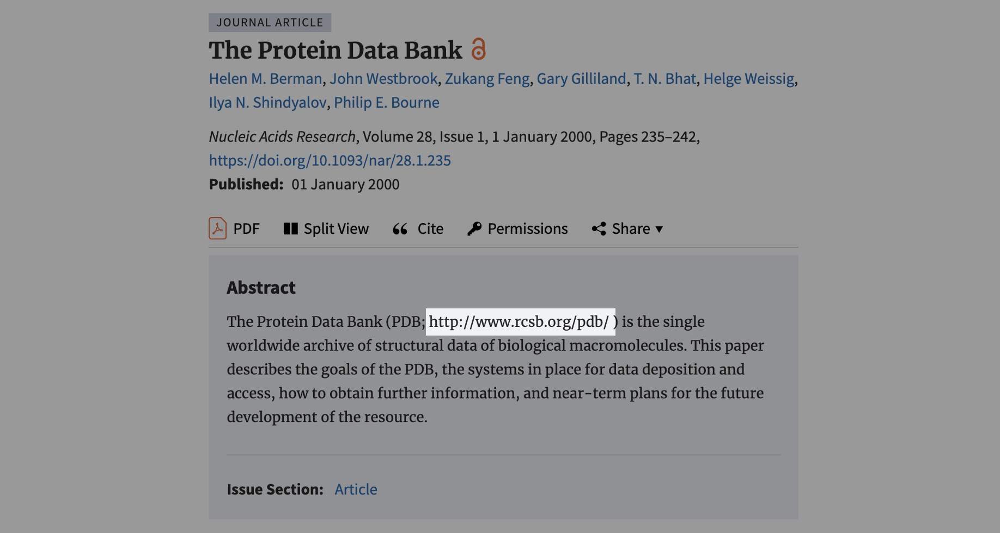

# References

[1] Few, Stephen. Information Dashboard Design: The Effective Visual Communication of Data. N.p., Oreilly & Associates Incorporated, 2006.

[2] WONG, Bang. Points of view: Gestalt principles (Part 1). nature methods, v. 7, n. 11, p. 863, 2010.

[3] FEW, Stephen; EDGE, Perceptual. The visual perception of variation in data displays. Perceptual Edge, p. 1-15, 2016.

[4] Nielsen, Jakob. 10 Usability Heuristics for User Interface Design (1994; updated in 2020). Available at https://www.nngroup.com/articles/ten-usability-heuristics/.

[5] Nielsen, J. (1994). Heuristic evaluation. In Nielsen, J., and Mack, R.L. (Eds.), Usability Inspection Methods, John Wiley & Sons, New York, NY.

[6] Huff, Darrell. How to lie with statistics. United Kingdom, Norton, 1954.
