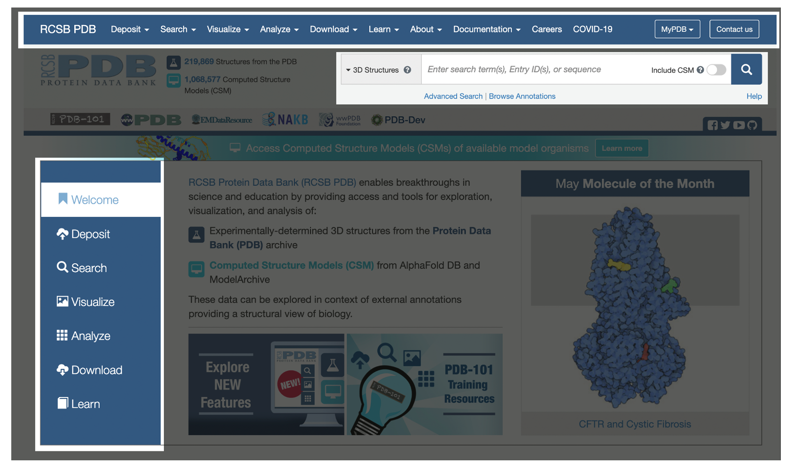
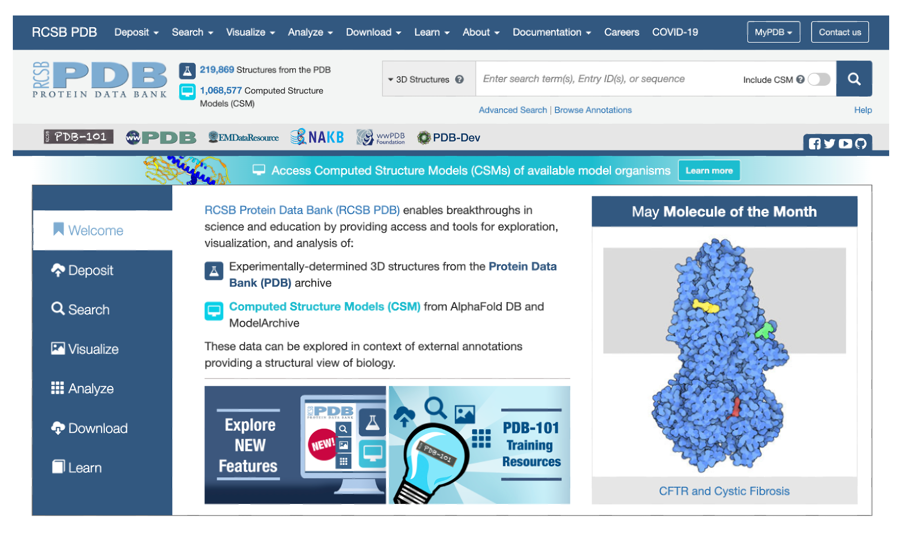
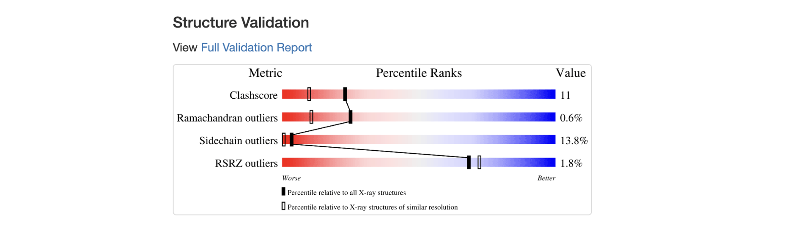

# Supplementary material 
> for <b>“A guide to developing web tools for bioinformatics”</b>

In this document, we present an example application of the "Checklist of important resources for user-friendly web tools".

Below, we introduce 10 recommendations for producing good web tools for bioinformatics applications. Then, we present a case study of a tool that meets all the requirements (the PDB website), so it can be considered a good example to be followed.

## The Guideline

This guide proposes 10 simple rules for developing a web tool for bioinformatics and producing an article promoting the tool. You can download a PDF with this checklist <a href="data/checklist.pdf">here</a>. 

The 10 requirements are:

> <b><a href="#requirement-1-quickstart">1. Quickstart</a></b>

> <b><a href="#requirement-2-simple-interface">2. Simple interface</a></b>

> <b><a href="#requirement-3-explain-what-this-tool-is">3. Explain what this tool is</a></b>

> <b><a href="#requirement-4-documentation-and-tutorials">4. Documentation and tutorials</a></b>

> <b><a href="#requirement-5-allow-exploration">5. Allow exploration</a></b>

> <b><a href="#requirement-6-handle-errors">6. Handle errors</a></b>

> <b><a href="#requirement-7-use-visualizations">7. Use visualizations</a></b>

> <b><a href="#requirement-8-export-results">8. Export results</a></b>

> <b><a href="#requirement-9-how-to-cite-this-tool">9. How to cite this tool</a></b>

> <b><a href="#requirement-10-linking-article-to-tool">10. Linking article to tool</a></b>

## Case study

As a case study, we use the PDB (Protein Data Bank) tool as a good example. PDB is available at https://www.rcsb.org/.

Therefore, for each item in the guideline we will present why the PDB web tool meets that requirement.

### Requirement #1. Quickstart

>The interface should be obvious enough for users to perform a quick analysis. Provide a button on every page that takes users to the page that starts new executions of the tool or that allows them to search and explore data. Use keywords like "new", "explore", "begin", "try", "start", "run", “home", "search", "analysis", and so on.

**Does the website meet the requirements?** Yes.

**Why?** The PDB home page, the website used in this case study, provides resources so that the user can quickly understand the objective of the tool. For example, we can quickly understand that it is a protein database and that we can search for specific proteins. Additionally, the top menu has some of the recommended keywords.

Available at https://www.rcsb.org/. Acessed at May 18, 2024.

### Requirement #2. Simple interface

>The interface should be simple and clean. It is recommended to use neutral colors (gray, white, black) for most components. Use color contrast to indicate points you want to draw attention to. You can use warm colors (red, yellow, or orange) to draw attention to specific points. Don't include too many visuals that overwhelm users' perception.

**Does the website meet the requirements?** Yes.

**Why?** The interface uses common features on web pages, such as top menus, a logo on the top left side, and a welcome message on the home page with brief explanations of what the tool is about. Furthermore, the interface was built using clean colors, making it easier to detect website sections. Note that I do not use excessive warm colors. The red section on the page draws attention to new features, which indicates good use of colors.

### Requirement #3. Explain what this tool is

> The interface must indicate the name of the tool (include a logo in the most important region of the page: the top left side) and provide descriptions about it (you can use subtitles, short description texts on the home page and /or include a link to "about" or "help" sections in the main menu).

**Does the website meet the requirements?** Yes.

**Why?**  The home page provides brief explanations about the purpose of the application.
 

To learn more, the top menu provides the "about" item, from which users can obtain specific information on demand.

 

 
### Requirement #4. Documentation and tutorials

> Provide complete documentation and usage tutorials. This documentation can be added as HTML on a separate page or can be included in PDF or MD format files. Access links should preferably be in the main menu. Video tutorials are welcome. When including functions that allow you to change parameters, include quick ways for the user to learn more about the parameter. You can include contextual help, such as descriptive text next to the field, or help buttons that are accessible on demand (when clicked or when the mouse is hovered over the button).

**Does the website meet the requirements?** Yes.

**Why?** In the top menu, the user can click on the "documentation" button and access detailed explanations for various features of the tool.

For example, the user can click on the FAQ page to consult frequently asked questions.

 
Available at https://pdb101.rcsb.org/learn/guide-to-understanding-pdb-data/introduction

Furthermore, the PDB provides a special section for training in basic fundamentals in the field of macromolecule analysis. Note that the page interface changes to indicate that it is a different resource than the main website.

They go further by including links to a YouTube channel, with video tutorials on the tool's features and research fundamentals.

Available at https://www.youtube.com/user/RCSBProteinDataBank 
 
### Requirement #5. Allow exploration

>Provide a way for users to explore your data. You can provide a page to explore and filter examples, create an entry example page, provide a simple example in Quickstart, or just put that example in the documentation. 

**Does the website meet the requirements?** Yes.

**Why?** On the home page, they provide a link to the individual page of an example entry. They display the most recent entries included in the database or link to the editors' chosen "molecule of the month."

 

After choosing one of the entries, the user is taken to their individual page. All individual entry pages should have a similar interface with visuals that make it easy to compare different entries.

Available at https://www.rcsb.org/structure/8WNY

For example, the user can navigate to different features of this page through the menu that appears just below the main menu.
The positioning of these items makes it easier to explore this page.

### Requirement #6. Handle errors
>Errors are usually unavoidable. When developing a web tool, you must anticipate possible errors and provide the system with ways to prevent them when possible, or handle them and display personalized messages that explain them. Therefore, conduct tests with the development team and external users without prior knowledge of the tool. Additionally, provide ways for users to get in touch if they encounter any errors. If your tool allows data entry, explain how these files should be formatted so that errors do not occur.

**Does the website meet the requirements?** Yes.

**Why?** This database provides a series of error handling. For example, look at what happens if we search for an identifier that does not exist.

Another example is when we try to access a non-existent page.

### Requirement #7. Use visualizations

>Use data visualization features such as interactive charts and tables. Remember that visualizations should make data easier to understand and should not be added just because they are pretty. Often, bar or line charts and tables that allow sorting can be the best ways to display results.

**Does the website meet the requirements?** Yes.

**Why?** Data visualizations are features that allow for better analysis and understanding of the data sets presented by the web tool. PDB has a series of different interactive visualizations that make good use of web technologies' advantages for data visualization.

In this example, we can see an interactive visualization of protein structure. The user can click on parts of the protein to view details. You can also rotate, translate, and zoom parts of the structure you want to see better. JavaScript plugins provide this visualization.

 
Available at https://www.rcsb.org/3d-view/2LZM?preset=validationReport

They also use other more traditional visualizations, such as bar, area and point graphs, to present details of the structure.

Available at https://www.rcsb.org/sequence/2LZM

The use of colors is also used in visualizations to indicate the quality of the data (typically, red indicates low quality, while blue indicates high quality).

Available at https://www.rcsb.org/structure/2LZM

 
### Requirement #8. Export results

>After using your tool, users may need or want to export the data (raw data, figures, and tables). Provide ways for this, and explain the available output formats.

**Does the website meet the requirements?** Yes.

**Why?**  The application allows data download and provides links on the main menus.

Available at https://www.rcsb.org/stats/growth/growth-released-structures 

Additionally, on specific pages that display charts, you can download the data that generates the visualization.

### Requirement #9. How to cite this tool

>Indicate in the interface how you want users to cite your tool (you can add it in the footer or create a page indicated in the main menu). It is okay to ask users to cite more than one paper (sometimes, you may have published the methodology and the web tool in different papers). However, it is important to use common sense (e.g., do not ask to cite too many articles).

**Does the website meet the requirements?** Yes.

**Why?** The website provides a link to indicate how the tool should be cited. As it is an academic tool, developers must be concerned about how users should cite their tool. Generally, this information is displayed in the footer of websites.

When clicking on this link, the user is taken to a page that will display details of different contexts in which the database can be cited.

 
Available at https://www.rcsb.org/pages/policies#References

 
### Requirement #10. Linking article to tool

>The access link for the tool paper must be visible in the manuscript (preferably in the abstract). Ensure that the link is available and that there are no broken links in the article. Broken links create a bad first impression.

**Does the website meet the requirements?** Yes.

**Why?** The authors include a link to the tool in the abstract of the publication.

The last requirement is not directly related to the tool, but rather to the article that describes it.

Some authors forget to include the tool's access link when submitting a paper. This link is essential for reviewers to test the tool's features and evaluate its usability.

To evaluate this topic, we consulted the following publication:

<code>H.M. Berman, J. Westbrook, Z. Feng, G. Gilliland, T.N. Bhat, H. Weissig, I.N. Shindyalov, P.E. Bourne. <b>The Protein Data Bank (2000)</b>. Nucleic Acids Research 28: 235-242 https://doi.org/10.1093/nar/28.1.235.</code>

When consulting the publication that describes this tool, we can see that the link was added in the abstract.

